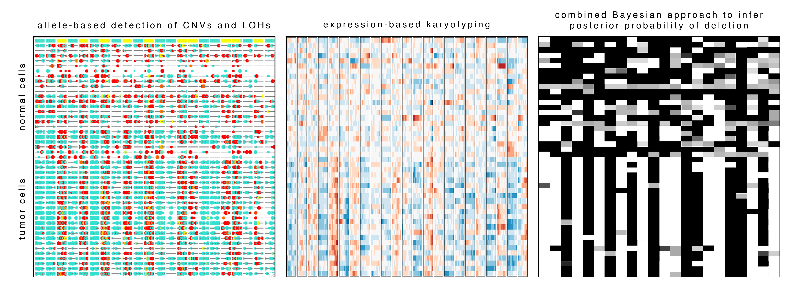

# Overview of BADGER

[](https://travis-ci.org/JEFworks/badger)


The `badger` package implements a hierarchical Bayesian approach for inferring copy number alterations and loss of heterozygosity events from single-cell RNA-seq data based on allele and gene expression patterns.


# Installation

```
require(devtools)
devtools::install_github('JEFworks/badger', build_vignettes = FALSE)
```


# Sample analyses and images




# Contributing

We welcome any bug reports, enhancement requests, and other contributions. To submit a bug report or enhancement request, or for general discussions or troubleshooting, please use the [`badger` GitHub issues tracker](https://github.com/JEFworks/badger/issues). For more substantial contributions, please fork this repo, push your changes to your fork, and submit a pull request with a good commit message. 

---
    
`badger` is created and maintained by [Jean Fan](https://github.com/jefworks) of the [Kharchenko Lab](http://pklab.med.harvard.edu/) at the [Department of Biomedical Informatics at Harvard Medical School](https://github.com/hms-dbmi).

